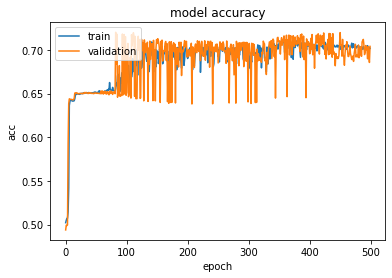

# Predicting Hotel Cancellations with a Keras Neural Network: Part 2

In a previous post, a support vector machine (SVM) was used to predict whether a customer that had made a hotel booking would ultimately cancel or not.

Through building the models on the training set (H1) and then validating them against a separate test set (H2), the AUC score came in at **0.74**.

The purpose of this follow up article is to determine whether a neural network built using Keras demonstrates higher accuracy in predicting hotel cancellations for the test set. In other words, can a higher AUC be achieved by using a neural network instead of an SVM?

## Scaling data

The full code containing the output in a Jupyter notebook is available at the following GitHub repository.

Since a neural network is being used, consideration must be given to how the data is processed before the model is run outright. Using the binary cancellation variable (0 = no cancellation or 1 = cancellation) as the response variable, **country**, **deposit type**, and **lead time** are used as the predictor variables. Specifically, two factors are taken into consideration:

- A *LabelEncoder* is used for country and deposit type categorical variables, in order to ensure that the neural network interprets them as categories rather than ordinal variables.

- *minmax_scale* is then used to scale the lead time variable to values between 0 and 1. If the variable is not scaled in accordance with the response variable, then it will be more difficult for the neural network to make proper interpretations.

## Neural Network (Building on H1 training set)

The neural network model itself consists of one hidden layer along with a sigmoid activation function:

```
from tensorflow.keras import models
from tensorflow.keras import layers

model = models.Sequential()
model.add(layers.Dense(8, activation='relu', input_shape=(4,)))
model.add(layers.Dense(1, activation='sigmoid'))
```

500 epochs are generated using the *adam* optimizer, and *binary_crossentropy* is used as a loss measure.

```
from tensorflow.keras import optimizers
from tensorflow.keras import losses
from tensorflow.keras import metrics

model.compile(optimizer='adam',
              loss='binary_crossentropy',
              metrics=['acc'])

history=model.fit(x1_train,
                  y1_train,
                  epochs=500,
                  batch_size=512,
                  validation_data=(x1_test, y1_test))
```

The 500 epochs are run, and here are some of the results:

```
Train on 15000 samples, validate on 5000 samples
Epoch 1/500
15000/15000 [==============================] - 1s 100us/sample - loss: 1.3946 - acc: 0.4633 - val_loss: 0.7325 - val_acc: 0.4940
Epoch 2/500
15000/15000 [==============================] - 0s 9us/sample - loss: 0.7447 - acc: 0.5000 - val_loss: 0.7285 - val_acc: 0.4410
Epoch 3/500
15000/15000 [==============================] - 0s 8us/sample - loss: 0.7250 - acc: 0.4658 - val_loss: 0.7250 - val_acc: 0.4936
.....
Epoch 498/500
15000/15000 [==============================] - 0s 8us/sample - loss: 0.5968 - acc: 0.6833 - val_loss: 0.5951 - val_acc: 0.6818
Epoch 499/500
15000/15000 [==============================] - 0s 8us/sample - loss: 0.5966 - acc: 0.6962 - val_loss: 0.5944 - val_acc: 0.7052
Epoch 500/500
15000/15000 [==============================] - 0s 9us/sample - loss: 0.5968 - acc: 0.6963 - val_loss: 0.5941 - val_acc: 0.6868
```

### Model Loss


### Model Accuracy



For the training and validation sets, we can see that the loss is minimised and accuracy maximized after approximately 100 epochs, not withstanding the fact that there is some volatility in validation accuracy across each epoch.

The model is used to make predictions using predictor data from the validation set, and the AUC generated is **0.747**.


## Predicting for H2 (test set)

